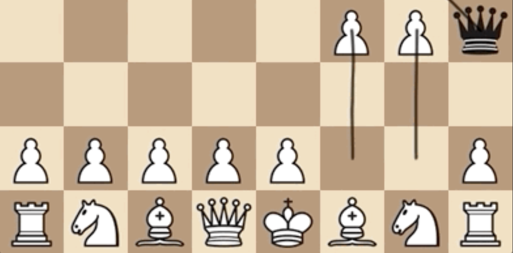

# *Chesses 2*

## [Play Online](https://www.pippinbarr.com/chesses2/) (desktop and mobile)

## Description
*You've chessed! You've chessesed! But have you chesses2ed?! You haven't?! Game on! Peer through the fog of war! Go through the cycle of death and rebirth! Experience the hottest new XR app in town!*

_Chesses 2_ is another set of eight variations on the classic game of chess, following closely in the footstps of [*Chesses*](https://www.pippinbarr.com/chesses/). Play chess with a Fog of War. Play chess in 3D. Play chess like it's checkers.

## Press

Read the [Press kit](../press) for press information

## Documentation

* Read the [Process documentation](../process) for process journal, to do list, and related work
* Read the [Commit History](https://github.com/pippinbarr/chesses2/commits/master) for step-by-step information about how the project was built
* Look at the [Code Repository](https://github.com/pippinbarr/chesses2) for source code etc.

## License
*Chesses 2* is an open source game licensed under a [Creative Commons Attribution-NonCommercial 3.0 Unported License](http://creativecommons.org/licenses/by-nc/3.0/). You can obtain the source code from its [code repository](https://github.com/pippinbarr/the-artist-is-present-2) on GitHub.
