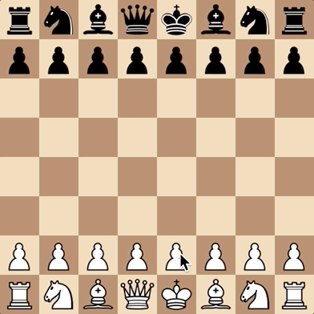
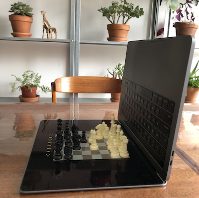

# _Chesses 2_ Press Kit

_You've chessed! You've chessesed! But have you chesses2ed?! You haven't?! Game on! Peer through the fog of war! Go through the cycle of death and rebirth! Experience the hottest new XR app in town!_

#### [Play _Chesses 2_](https://pippinbarr.github.io/chesses2) (Desktop and Mobile)

## The basics

* Developer: [Pippin Barr](http://www.pippinbarr.com/)
* Release: 1 April 2020
* Platform: Browser (desktop and mobile)
* Code repository: https://github.com/pippinbarr/chesses2
* Price: $0.00

## Who is this Pippin Barr guy?

Pippin is an experimental game developer who has made games about everything from [Eurovision](http://www.pippinbarr.com/2012/03/27/epic-sax-game/) to [performance art](http://www.pippinbarr.com/2011/09/14/the-artist-is-present/) to [dystopian post-work futures](http://www.pippinbarr.com/games/2017/07/03/it-is-as-if-you-were-doing-work.html). He's an Assistant Professor in the [Department of Design and Computation Arts](http://www.concordia.ca/finearts/design.html) at [Concordia University](http://www.concordia.ca/) in Montréal. He is also the associate director of the [Technoculture, Art, and Games (TAG)](http://tag.hexagram.ca/) Research Centre, which is part of the [Milieux Institute for Arts, Culture, and Technology](http://milieux.concordia.ca/).

## Description

_Chesses 2_ is a sequel to my previous game [_Chesses_](https://pippinbarr.github.io/chesses/), as you might imagine. It's a further set of eight variations on the standard game of chess, comprising everything from the addition of a "fog of war" to pieces that change sides each move to game of chess that create drawings.

I think it's important to note that chess is a game with a [huge history of variations](https://www.chessvariants.com/) and at least two of the variants presented here are ideas others have had. Notably, there are multiple versions of chess with a "fog of war", including [Dark Chess](https://en.wikipedia.org/wiki/Dark_chess) (invented in 1989) and [Fog of War Chess](https://www.chessvariants.com/other.dir/fog_of_war_chess.html) (no date). As far as I can tell, other versions don't implement the precise rules I settled on for visibility - in particular I allow every piece to see the adjacent squares, and I also tune visibility by the number of pieces that can see a square for visual effect. Similarly, chess variants based on checkers already exit, such as [Chesskers](http://www.chesskers.com/) and [Chessers](https://boardgamegeek.com/boardgame/13626/chessers). Again, the version presented here as CHECK-RS seems to use a significantly different rule set. There's room for everyone!

## History

I started _Chesses 2_ almost entirely because I was stuck on another project (_v r 4_) and, in the midst of the madness of a COVID-19 world, I needed something "straightforward" to work on and get some traction with. Making variations is generally my favourite design and development exercise because it lets me focus mostly on ideas and less on extremes of detail and implementation. That's not to say there weren't complexities in implementing the ideas (or indeed ideas that failed utterly), but it's a nice headspace to just do something without worrying too much.

As with _Chesses_, I pretty much just sat down and tried to come up with a few ways of representing chess, going through rejected ideas for the first game, and coming up with new approaches. In this iteration I think I favoured a balance of easy-to-get joke games that were simple to make (3D chess, anyone?) alongside more complex reinterpretations that took work but may actually lead to interesting play (CHECK-RS chess is a nice example of this I suspect).

_Chesses 2_ is also another data-point in the ultra-detailed process documentation approach called [MDMA](http://www.gamesasresearch.com/mdma). So, if you want to, you can read a lot about the game's development by reading its [process documentation](https://github.com/pippinbarr/chesses2/blob/master/process/README.md) and by going through its [commit history](https://github.com/pippinbarr/chesses2/commits/master).

## Technology

_Chesses 2_ was created in JavaScript using the ever-so-useful [chess.js](https://github.com/jhlywa/chess.js) and [chessboard.js](https://chessboardjs.com/) libraries which together make representing chess (or variants) remarkably straightforward compared to the true nightmare it would be to do from scratch. It also involves some [jQuery](https://jquery.com/) and [jQuery UI](https://jqueryui.com/). The sound stuff in musical chess uses the lovely sound library [Pizzicato.js](https://alemangui.github.io/pizzicato/). The drawing in LeWitt chess uses [p5.js](https://p5js.org/).

## License

_Chesses 2_ is an open source game licensed under a [Creative Commons Attribution-NonCommercial 3.0 Unported License](http://creativecommons.org/licenses/by-nc/3.0/). You can obtain the source code from its [code repository](https://github.com/pippinbarr/chesses) on GitHub.

## Features

- Fog!
- XR technology!
- Multi-jump captures!
- Chords in the key of A major!
- The poignant cycle of death and rebirth!

### Trailer

See animated GIFs.

## Images

  
CHECK-RS

  
FOG

  
LEWITT

  
REVERSAL

  
SAMSARA

  
XR (Cross-Reality) [(click for larger image)](images/xr-chess-large.png)]

## Additional Links

- [Process documentation of _Chesses 2_](https://github.com/pippinbarr/chesses2/blob/master/process/README.md)
- [Commit history of _Chesses 2_](https://github.com/pippinbarr/chesses/commits2/master)

## Credits

* Pippin Barr: basically everything?

## Contact

* Email: [pippin.barr+press@gmail.com](mailto:pippin.barr+press@gmail.com)
* Website: [www.pippinbarr.com](http://www.pippinbarr.com/)
* Twitter: [@pippinbarr](https://www.twitter.com/pippinbarr)
* Instagram: [@pippinbarr](https://www.instagram.com/pippinbarr)
* Facebook: [Pippin Barr](http://www.facebook.com/pippin.barr)
